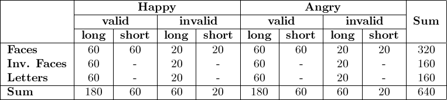

<h2>Table of Contents</h2>

<ul>
<li><a href="#orgheadline11">1. Design Ideas (Protokoll [2016-07-25 Mo])&#xa0;&#xa0;&#xa0;&#xa0;</a>
<ul>
<li><a href="#orgheadline1">1.1. Basic Ideas</a></li>
<li><a href="#orgheadline5">1.2. Design</a>
<ul>
<li><a href="#orgheadline2">1.2.1. Trial Structure</a></li>
<li><a href="#orgheadline3">1.2.2. Factors</a></li>
<li><a href="#orgheadline4">1.2.3. Table of Conditions</a></li>
</ul>
</li>
<li><a href="#orgheadline8">1.3. Expected Simple Effects</a>
<ul>
<li><a href="#orgheadline6">1.3.1. behavioral: congruency effect (RT &amp; accuracy)</a></li>
<li><a href="#orgheadline7">1.3.2. neuronal (ERD in mu band)</a></li>
</ul>
</li>
<li><a href="#orgheadline9">1.4. Additional Exploratory Lines of Questioning</a></li>
<li><a href="#orgheadline10">1.5. Open Questions</a></li>
</ul>
</li>
</ul>

# Design Ideas (Protokoll [2016-07-25 Mo])     :::

## Basic Ideas

-   Mu and simulation are related
-   A pronounced ERD in mu signals 'simulative' aspects of one of at least three processes:
    -   action observation
    -   action preparation
    -   action execution
-   Simulation 'entrenches' these processes, presumably making it more difficult to &#x2026;
    -   inhibit them,
    -   switch (attention) to other actions / stimuli or prepare for them
-   We want to manipulate the 'simulation characteristics' of the stimuli to investigate these assumptions
-   In Response Priming speak, this means: the more 'simulative' the task / prime stimulus
    -   the larger the congruency effect and
    -   the more pronounced the mu component

-   It is likely that ERD in Alpha (even in central regions) will be influenced by spatial attention

## Design

-   Response Priming Paradigm: Prime -> <blank> -> Target (valid or invalid)

### Trial Structure

-   with an ITI of 2500 ms, the duration of each trial amounts to **6800 ms** (with the default SOA of 1800 ms)
    -   A shorter SOA (900 ms) yields a total trial duration of **5900 ms**

### Factors

-   Manipulated factors (within subject)
    -   **Expression:** Two target emotions of different valence (e.g. *Happy* vs. *Angry*) [\*80 Trials / Expression\*]
    -   **Validity:** congruence of Prime and Target Stimulus or Prime and Response (*valid* vs. *invalid*) [75% of trials valid]
-   those yield the four 'basic' conditions present in each Response Priming experiment
-   we will additionally manipulate:
    -   **Stimulus Type:** *Faces* vs. *Inverted Faces* vs. *Letters*
    -   **SOA:** Difference in time between Prime and Target Stimulus Onset (*long* (1800 ms) vs. *short* (900 ms))
-   Fully crossed, such a **23x3** factorial design would yield 24 conditions and a total runtime of about **102 minutes**
-   We will thus opt for an **incomplete** (or reduced)  **factorial design**, manipulating the SOA only in the StimType-Faces Conditions:
    -   this reduces the number of conditions to 16 and the length of the experiment to about **70 minutes**
    -   this design will **not** be balanced and thus cannot be described as a 23-1x3 fractional factorial design
    -   all main effects will be confounded by interaction effects involving SOA

### Table of Conditions

-   total: 70 minutes (54 min SOAlong, 16 min SOAshort)
-   blockwise:
    -   Faces: 34 minutes
    -   Inverted Faces: 18 minutes
    -   Letters: 18 Minutes
-   total length without Inverted Faces: 52 minutes
-   total length without inverted Faces, with full factorial design: 68 minutes

## Expected Simple Effects

### behavioral: congruency effect (RT & accuracy)

We expect interactions between Validity and StimType as well as Validity and SOA with regard to the congruency effect (RT(invalid) - RT(valid)). The expected contrasts are as follows:

-   Faces > Inverted Faces > Letters (in SOAlong)
-   SOAshort > SOAlong (in StimTypefaces)

### neuronal (ERD in mu band)

-   Faces > Inverted Faces > Letters
-   SOAshort > SOAlong

## Additional Exploratory Lines of Questioning

-   Interactions between SOA and Expression
-   Interindividual Differences in mu ERD (& rebound)?
-   pre-Stimulus mu ERD as predictor of speed/accuracy on single-trial-level?
-   Chronometry of mu ERD (and its relation to expression/valence)

## Open Questions

-   [ ] Choice of Target Signal:
    -   perceptual difference to Prime?
    -   identical signal in each StimType condition?
-   [ ] Perceptual equivalence of stimuli (esp. StimTypeFaces and StimTypeLetters)
-   Impossible to disassociate 'sources' or 'types' of simulation causing mu ERDs
    -   observation vs. preparation vs. attentional shifts
    -   increased task difficulty increases mu ERD (attentional demands)
-   effect of StimType due to different task demands? (reading/symbolic mapping in Letters condition, coding of emotional facial expression in Faces condition; inverted faces might need to be rotated mentally)
-   strategy for identifying mu components
-   strategy for quantifying strength of mu ERD
-   &#x2026;
